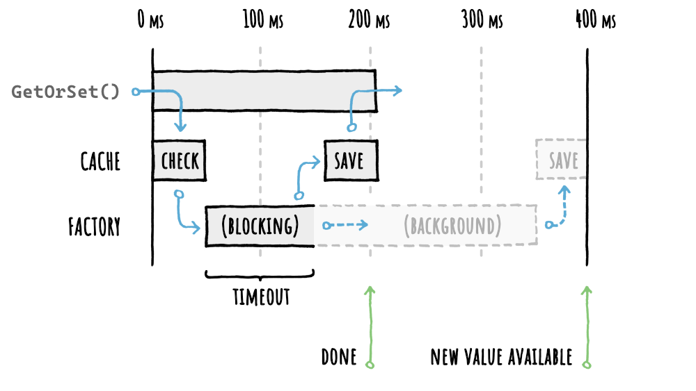

<div align="center">


</div>

# ⏱️ Timeouts

| ⚡ TL;DR (quick version) |
| -------- |
| We can enable [fail-safe](FailSafe.md) and specify soft/hard timeouts to ease slow factories: in this way when FusionCache calls a factory, if the specified timeouts are hit, it will temporarily re-use the old value and allow the factory to complete in the background and the upate the cached value, getting the best of both worlds. This technique can be used alongside [eager refresh](EagerRefresh.md). |

There are different types of timeouts available and it may be useful to know them:
- Factory Timeouts
- Distributed Cache Timeouts

For a complete example of how to use them and what results we can achieve there's the [👩‍🏫 Step By Step](StepByStep.md) guide.
## Factory Timeouts

Sometimes our data source (database, webservice, etc) is overloaded, the network is congested or something else bad is happening and the end result is things start to get **:snail: very slow** to get a fresh piece of data.

Wouldn't it be nice if there could be a way to simply let FusionCache temporarily reuse an expired cache entry if the factory is taking too long?

Enter **soft/hard timeouts**.

We can specify:

- `FactorySoftTimeout`: to be used if there's an expired cache entry to use as a fallback

- `FactoryHardTimeout`: to be used in any case, no matter what. In this last case a `SyntheticTimeoutException` will be thrown and we'll have to handle it ourself, but in some cases that would be more preferable than a very slow response

Basically if we enable **soft** timeout we are saying _"during a refresh if the factory takes more than X time, I prefer to temporarily reuse a stale (expired) value instead of waiting too much"_.

If instead we enable **hard** timeouts we are saying _"during a refresh if the factory takes more than X time, even if there's no stale value to use as a fallback, we prefer to receive an exception instead of waiting too much"_ because we prefer to be fast and handle the error yourself.

We can specify them both (the **soft** should be lower than the **hard**, of course) and the appropriate one will be used based on the presence of an expired entry to be eventually used as a fallback.

In both cases it's possible to set the bool flag `AllowTimedOutFactoryBackgroundCompletion`: it is enabled *by default*, so we don't have to do anything, and it lets the timed-out factory keep running in the background and update the cached value as soon as it finishes.

This will give us the best of both worlds: a **fast response** and **fresh data** as soon as possible.

> [!NOTE]
> Warning levels related to timeouts are configurable (via `FusionCacheOptions`), so we can "suppress" them by setting the related log level to trace or similar.

### 👩‍💻 Example
As an example let's say we have a piece of code like this:

```csharp
product = cache.GetOrSet<Product>(
    "product:123",
    _ => GetProductFromDb(123),
    options => options
        .SetDuration(TimeSpan.FromMinutes(2))
);
```

In this **very hypothetical and made up scenario** (don't look too much into the numbers, they just serve as a reference point) we may have a timeline like this:


As we can see in this case the factory is taking around `300 ms`, and the entire method call is taking around `400 ms`, which is too much for us.

So we simply enable **fail-safe** and specify a **soft timeout** of `100 ms`:

```csharp
product = cache.GetOrSet<Product>(
    "product:123",
    _ => GetProductFromDb(123),
    options => options
        .SetDuration(TimeSpan.FromMinutes(2))
        // ENABLE FAIL-SAFE
        .SetFailSafe(true)
        // SET A 100 MS SOFT TIMEOUT
        .SetFactoryTimeouts(TimeSpan.FromMilliseconds(100))
);
```

The end result is this:



Now after `100 ms` the factory will timeout and FusionCache will **temporarily** give us back the expired value, in about `200 ms` total.

Also, it will complete the factory execution **in the background**: as soon as it will complete, the cached value **will be updated** so that any new request will have the fresh value ready to be used.


## ⏱️ Distributed Cache Timeouts

When using a distributed cache it is also possible to observe some slowdowns in case of network congestions or something else.

In this case it may be useful to also set soft/hard timeouts for the distributed cache (`DistributedCacheSoftTimeout` and `DistributedCacheHardTimeout`) for the operations that must be awaited (like getting a value), whereas the non critical ones (like saving a value) can simply run in the background, so a timeout is less important.

One last flag available in this space is `AllowBackgroundDistributedCacheOperations`: this will execute most operations on the distributed cache in the background like in a *fire-and-forget* way, so we will get most likely a perf boost.

Usually we can enable this without problems, but **remember** that if we somehow bypass FusionCache and directly check the distributed cache right after the method call is completed, maybe the distributed cache may not be updated yet.

Here's an example of such a particular scenario:

```csharp
// INSTANTIATE REDIS AS A DISTRIBUTED CACHE
var redis = new RedisCache(new RedisCacheOptions() {
    Configuration = "CONNECTION STRING"
});

// INSTANTIATE THE FUSION CACHE SERIALIZER
var serializer = new FusionCacheNewtonsoftJsonSerializer();

// INSTANTIATE FUSION CACHE
var cache = new FusionCache(new FusionCacheOptions());

// SETUP THE DISTRIBUTED 2ND LEVEL
cache.SetupDistributedCache(redis, serializer);

// SET A VALUE IN THE CACHE VIA FUSION CACHE, WITH BACKGROUND DISTRIBUTED OPERATIONS
cache.Set<string>(
    "foo",
    "Sloths, sloths everywhere",
    new FusionCacheEntryOptions { AllowBackgroundDistributedCacheOperations = true }
);

// HERE foo MAY BE NULL, BECAUSE THE DISTRIBUTED CACHE MAY STILL BE SAVING THE VALUE IN THE BACKGROUND
var foo = redis.GetString("foo");
```
